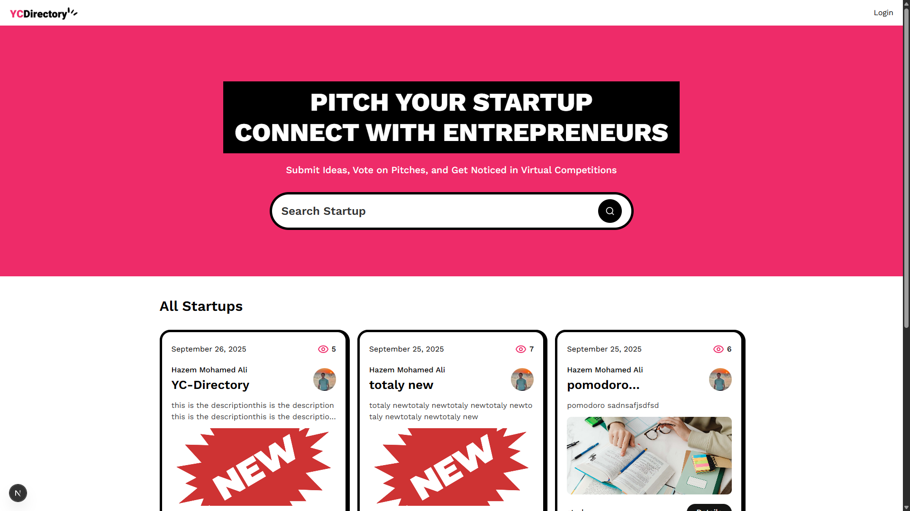
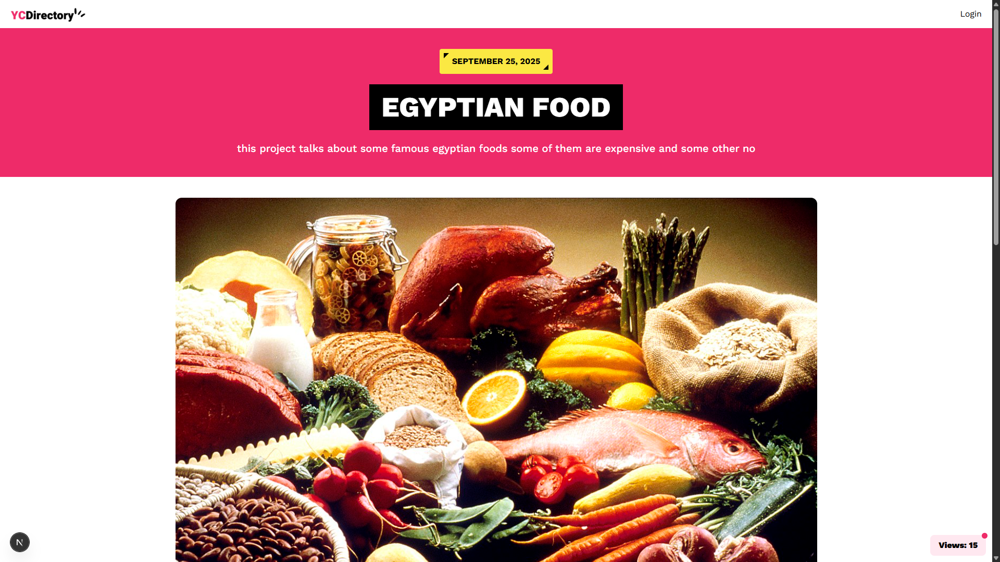
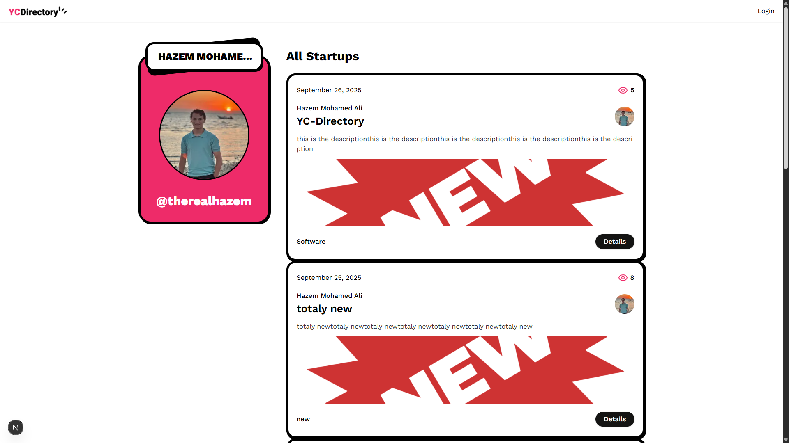
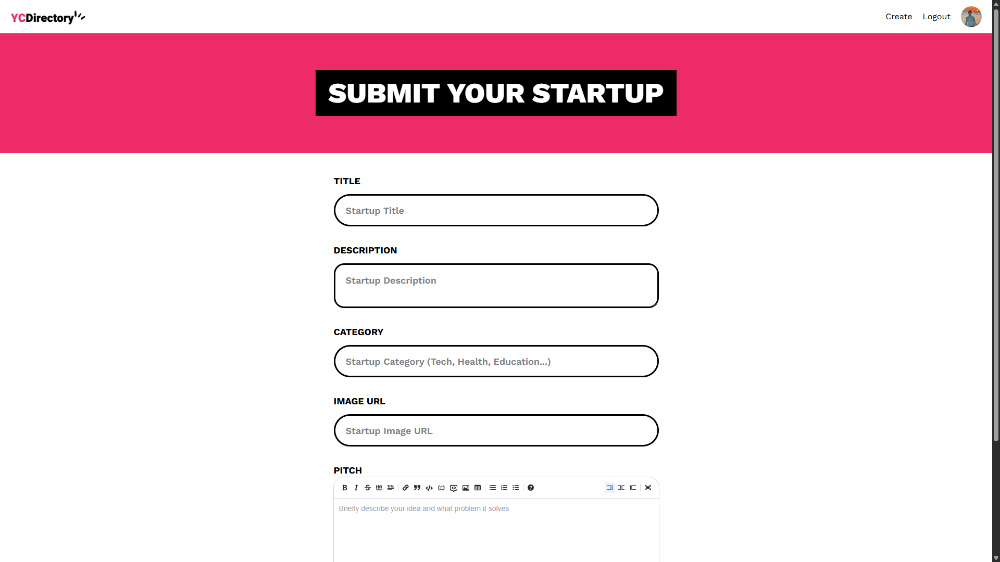

<div align="center">


# 🚀 YC Directory

**Pitch, Vote and Grow**

A modern startup directory platform where entrepreneurs can showcase their ideas, connect with like-minded individuals, and gain exposure through virtual pitch competitions.


## 🌐 **LIVE PREVIEW**

[](https://yc-directory-therealhazem.vercel.app/)

**👉 [https://yc-directory-therealhazem.vercel.app/](https://yc-directory-therealhazem.vercel.app/) 👈**

*Experience the full platform with real startup submissions and interactive features*

</div>

---

## 📋 Table of Contents

- [🤖 Introduction](#-introduction)
- [⚙️ Tech Stack](#️-tech-stack)
- [🔋 Features](#-features)
- [🤸 Quick Start](#-quick-start)
- [🕸️ Project Structure](#️-project-structure)
- [🔗 Environment Variables](#-environment-variables)
- [🚀 Deployment](#-deployment)
- [📱 Screenshots](#-screenshots)
- [🤝 Contributing](#-contributing)

---

## 🤖 Introduction

YC Directory is a comprehensive platform designed for the startup ecosystem, enabling entrepreneurs to:

- **Submit & Showcase** their innovative startup ideas
- **Connect** with fellow entrepreneurs and potential investors
- **Gain Exposure** through a clean, professional presentation
- **Track Engagement** with detailed view analytics
- **Discover** trending startups and emerging technologies

Built with modern web technologies and a focus on user experience, this platform provides a seamless environment for startup discovery and networking.

---

## ⚙️ Tech Stack

### Frontend
- **React 19** - Modern UI library with hooks and functional components
- **Next.js 15** - Full-stack React framework with App Router
- **TypeScript** - Type-safe JavaScript development
- **TailwindCSS** - Utility-first CSS framework
- **ShadCN/UI** - Beautiful, accessible component library

### Backend & Database
- **Sanity CMS** - Headless content management system
- **NextAuth.js** - Authentication with GitHub OAuth
- **Server Actions** - Modern server-side data mutations

### Development Tools
- **ESLint** - Code linting and quality assurance
- **PostCSS** - CSS processing and optimization
- **Markdown Editor** - Rich text editing for pitch descriptions

---

## 🔋 Features

### 🎯 Core Functionality
- **👉 Live Content API**: Real-time startup data from Sanity CMS
- **👉 GitHub Authentication**: Seamless login with GitHub accounts
- **👉 Pitch Submission**: Complete startup idea submission with rich markdown editor
- **👉 Dynamic Search**: Real-time search across titles, categories, and authors
- **👉 View Tracking**: Automatic view counter for each startup pitch

### 🎨 User Experience
- **👉 Responsive Design**: Mobile-first approach with TailwindCSS
- **👉 Modern UI**: Clean, minimalistic design with custom styling
- **👉 Interactive Elements**: Hover effects, animations, and smooth transitions
- **👉 Toast Notifications**: User feedback for all actions
- **👉 Loading States**: Skeleton loaders and loading indicators

### 📊 Content Management
- **👉 Editor Picks**: Admin-curated featured startups
- **👉 Category Filtering**: Browse startups by technology, industry, or focus area
- **👉 User Profiles**: Individual pages showcasing all user submissions
- **👉 Markdown Support**: Rich text formatting for detailed pitch descriptions

### 🔧 Technical Features
- **👉 Type Safety**: Full TypeScript implementation
- **👉 Server Components**: Optimized rendering with Next.js 15
- **👉 Image Optimization**: Automatic image processing and CDN delivery
- **👉 SEO Optimized**: Meta tags, structured data, and performance optimization
- **👉 Error Handling**: Comprehensive error boundaries and user feedback

---

## 🤸 Quick Start

### 🌐 **Try It Live First!**

**Before setting up locally, check out the live demo:**
👉 **[https://yc-directory-therealhazem.vercel.app/](https://yc-directory-therealhazem.vercel.app/)** 👈

*See the platform in action with real startup submissions, user profiles, and all interactive features!*

### Prerequisites

Make sure you have the following installed on your machine:

- **Git** - Version control system
- **Node.js** (v18 or higher) - JavaScript runtime
- **npm** (v9 or higher) - Package manager

### Installation

1. **Clone the repository**
   ```bash
   git clone https://github.com/therealhazem/YCdirectory.git
   cd yc-directory
   ```

2. **Install dependencies**
   ```bash
   npm install
   ```

3. **Set up environment variables**
   ```bash
   cp .env.example .env.local
   ```

4. **Configure your environment variables** (see [Environment Variables](#-environment-variables))

5. **Run the development server**
```bash
npm run dev
   ```

6. **Open your browser**
   Navigate to [http://localhost:3000](http://localhost:3000)

---

## 🕸️ Project Structure

```
yc-directory/
├── app/                          # Next.js App Router
│   ├── (root)/                   # Main application routes
│   │   ├── page.tsx             # Homepage
│   │   ├── startups/            # Startup-related pages
│   │   │   ├── [id]/           # Individual startup details
│   │   │   └── create/         # Create new startup
│   │   └── user/               # User profile pages
│   │       └── [id]/           # Individual user profiles
│   ├── api/                     # API routes
│   │   ├── auth/               # Authentication endpoints
│   │   └── track-view/         # View tracking API
│   ├── globals.css             # Global styles
│   └── layout.tsx              # Root layout
├── components/                   # Reusable UI components
│   ├── ui/                     # ShadCN/UI components
│   ├── Navbar.tsx              # Navigation component
│   ├── StartupCard.tsx         # Startup display card
│   ├── StartupForm.tsx         # Startup submission form
│   └── SearchForm.tsx          # Search functionality
├── lib/                         # Utility functions and configurations
│   ├── actions.ts              # Server actions
│   ├── queries.ts              # Sanity queries
│   ├── utils.ts                # Helper functions
│   └── validation.ts           # Form validation schemas
├── sanity/                      # Sanity CMS configuration
│   ├── schemaTypes/            # Content schemas
│   ├── lib/                    # Sanity client configuration
│   └── config.ts               # Sanity project configuration
└── public/                      # Static assets
    └── logo.png                # Application logo
```

---

## 🔗 Environment Variables

Create a `.env.local` file in the root directory with the following variables:

```env
# Sanity Configuration
NEXT_PUBLIC_SANITY_PROJECT_ID=your_project_id
NEXT_PUBLIC_SANITY_DATASET=production
NEXT_PUBLIC_SANITY_API_VERSION=2024-01-01
SANITY_TOKEN=your_sanity_token

# NextAuth Configuration
AUTH_SECRET=your_auth_secret
AUTH_GITHUB_ID=your_github_client_id
AUTH_GITHUB_SECRET=your_github_client_secret

# Optional: Sentry for error tracking
SENTRY_DSN=your_sentry_dsn
```

### Getting Your Credentials

1. **Sanity**: Create a project at [sanity.io](https://sanity.io)
2. **GitHub OAuth**: Create an OAuth app in your GitHub settings
3. **Auth Secret**: Generate a random string for session encryption

---

## 🚀 Deployment

### Vercel (Recommended)

1. **Connect your repository** to Vercel
2. **Add environment variables** in the Vercel dashboard
3. **Deploy** with automatic builds on every push

### Other Platforms

The application can be deployed to any platform that supports Next.js:
- **Netlify**
- **Railway**
- **DigitalOcean App Platform**
- **AWS Amplify**

---

## 📱 Screenshots

<div align="center">

### Homepage


### Startup Details


### User Profile


### Create Startup


</div>

---

## 🤝 Contributing

We welcome contributions! Please follow these steps:

1. **Fork the repository**
2. **Create a feature branch** (`git checkout -b feature/amazing-feature`)
3. **Commit your changes** (`git commit -m 'Add amazing feature'`)
4. **Push to the branch** (`git push origin feature/amazing-feature`)
5. **Open a Pull Request**

### Development Guidelines

- Follow the existing code style and conventions
- Write meaningful commit messages
- Add tests for new features
- Update documentation as needed
- Ensure all checks pass before submitting

---

<div align="center">

**Made with ❤️ by Hazem Elgindy**
**Fueled by Egyptian Songs & a Lot of Coffee**

**Check my [Portfolio](https://hazemelgindy.me)**

[⭐ Star this repo](https://github.com/therealhazem/YCdirectory) • [🐛 Report Bug](https://github.com/therealhazem/YCdirectory/issues) • [💡 Request Feature](https://github.com/therealhazem/YCdirectory/issues)

</div>